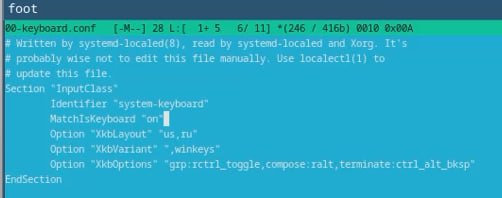
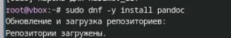
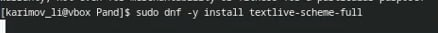
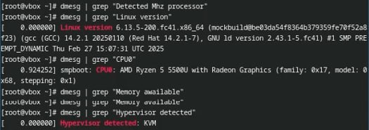
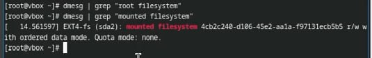

---
## Front matter
lang: ru-RU
title: Отчёт по лабораторной работе №1
subtitle: Простейший вариант
author:
  - Каримов Тимур Ринатович
institute:
  - Российский университет дружбы народов, Москва, Россия
date: 

## i18n babel
babel-lang: russian
babel-otherlangs: english

## Formatting pdf
toc: false
toc-title: Содержание
slide_level: 2
aspectratio: 169
section-titles: true
theme: metropolis
header-includes:
 - \metroset{progressbar=frametitle,sectionpage=progressbar,numbering=fraction}
---

# Информация

## Докладчик

:::::::::::::: {.columns align=center}
::: {.column width="70%"}

  * Каримов Тимур Ринатович
  * Студент 1-курса НММбд-02-24
  * Российский университет дружбы народов
  * [1132246817@pfur.ru](mailto:1132246817@pfur.ru)

:::
::: {.column width="30%"}

:::
::::::::::::::

# Вводная часть

## Актуальность

Умение использовать Linux является важным навыком для работы в IT-сфере, особенно для разработчиков, системных администраторов и исследователей.

## Объект и предмет исследования

- Установка и настройка операционной системы Linux
- Программное обеспечение для работы с документацией
- Настройка окружения для разработки

## Цели и задачи

- Приобрести практические навыки установки ОС на виртуальную машину
- Настроить минимально необходимые сервисы
- Установить и настроить ПО для создания документации

## Материалы и методы

- Виртуальная машина (VirtualBox, VMware)
- Операционная система Linux (дистрибутив на выбор)
- Программное обеспечение: `pandoc`, `texlive`, `tmux`, `kitty`
- Автоматизация процесса: `Makefile`

## Цель работы

Приобрести практические навыки установки операционной системы на виртуальную машину, настройки минимально необходимых для дальнейшей работы сервисов.

## Задание

1. Установка операционной системы
   1. Запуск приложения для установки системы
   2. Установка системы на диск
2. После установки
   1. Обновления
   2. Повышение комфорта работы
   3. Автоматическое обновление
   4. Отключение SELinux
3. Настройка раскладки клавиатуры
4. Установка программного обеспечения для создания документации
   1. Работа с языком разметки Markdown
   2. Установка texlive
5. Выполнение домашнего задания

#Выполнение лабораторной работы

## Установка операционной системы на диск

Загрузим LiveCD, запустим терминал, в нем запустим *liveinst*.

Выберем язык интерфейса и перейдем к настройкам установки системы. Установим имя и пароль пользователя *root*.

:::::::::::::: {.columns align=center}
::: {.column width="70%"}

{#fig:001 width=100%}

:::
::: {.column width="30%"}

Затем и для Моего пользователя.

:::::::::::::: {.columns align=center}
::: {.column width="70%"}

{#fig:002 width=100%}

:::
::: {.column width="30%"}

:::
::::::::::::::

:::
::::::::::::::

## После установки

После завершения установки, перезагружаем ОС. Нас встречает окно для входа в систему, с идентификацией пользователя.

:::::::::::::: {.columns align=center}
::: {.column width="70%"}

{#fig:003 width=100%}

:::
::: {.column width="30%"}

Откроем терминал и переключим на роль супер-пользователя и установим средства разработки.

:::::::::::::: {.columns align=center}
::: {.column width="70%"}

{#fig:004 width=100%}

:::
::: {.column width="30%"}

:::
::::::::::::::

:::
::::::::::::::

## Настройка окружения

И обновим все пакеты.

:::::::::::::: {.columns align=center}
::: {.column width="70%"}

{#fig:005 width=100%}

:::
::: {.column width="30%"}

Установим разные варианты консоли для удобства работы tmux.

:::::::::::::: {.columns align=center}
::: {.column width="70%"}

{#fig:006 width=100%}

:::
::: {.column width="30%"}

:::
::::::::::::::

:::
::::::::::::::

## Установка программного обеспечения

Установим ПО и запустим таймер.

:::::::::::::: {.columns align=center}
::: {.column width="70%"}

{#fig:008 width=100%}

:::
::: {.column width="30%"}

С помощью команды *mcedit* заменим значения в файле */etc/selinux/config*.

:::::::::::::: {.columns align=center}
::: {.column width="70%"}

{#fig:010 width=100%}

:::
::: {.column width="30%"}

:::
::::::::::::::

:::
::::::::::::::

## Настройка раскладки клавиатуры

Создадим конфигурационный файл *~/.config/sway/config.d/95-system-keyboard-config.conf*.

:::::::::::::: {.columns align=center}
::: {.column width="70%"}

{#fig:013 width=100%}

:::
::: {.column width="30%"}

Отредактируем конфигурационный файл */etc/X11/xorg.conf.d/00-keyboard.conf* и перезагрузим систему.

:::::::::::::: {.columns align=center}
::: {.column width="70%"}

{#fig:015 width=100%}

:::
::: {.column width="30%"}

:::
::::::::::::::

:::
::::::::::::::

## Установка программного обеспечения для создания документации

Установим *pandoc* для работы с *Markdown*.

:::::::::::::: {.columns align=center}
::: {.column width="70%"}

{#fig:016 width=100%}

:::
::: {.column width="30%"}

Установим дистрибутив TeXlive.

:::::::::::::: {.columns align=center}
::: {.column width="70%"}

{#fig:019 width=100%}

:::
::: {.column width="30%"}

:::
::::::::::::::

:::
::::::::::::::

## Выполнение домашнего задания

Получим следующую информацию:
1. Версия ядра Linux (Linux version).
2. Частота процессора (Detected Mhz processor).
3. Модель процессора (CPU0).
4. Объём доступной оперативной памяти (Memory available).
5. Тип обнаруженного гипервизора (Hypervisor detected).
6. Тип файловой системы корневого раздела.
7. Последовательность монтирования файловых систем.

:::::::::::::: {.columns align=center}
::: {.column width="70%"}

{#fig:021 width=100%}

:::
::: {.column width="30%"}

{#fig:022 width=100%}

:::
::::::::::::::

## Код для формата `pdf`

```yaml
slide_level: 2
aspectratio: 169
section-titles: true
theme: metropolis
