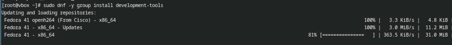
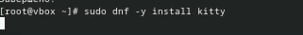
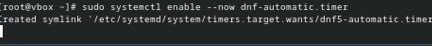
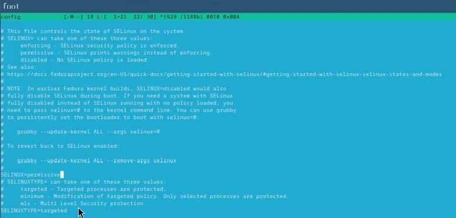

---
## Front matter
title: "Отчёт по лабораторной работе №1"
subtitle: "Простейший вариант"
author: "Тимур Ринатович Каримов"

## Generic otions
lang: ru-RU
toc-title: "Содержание"

## Bibliography
bibliography: bib/cite.bib
csl: pandoc/csl/gost-r-7-0-5-2008-numeric.csl

## Pdf output format
toc: true # Table of contents
toc-depth: 2
lof: true # List of figures
lot: true # List of tables
fontsize: 12pt
linestretch: 1.5
papersize: a4
documentclass: scrreprt
## I18n polyglossia
polyglossia-lang:
  name: russian
  options:
	- spelling=modern
	- babelshorthands=true
polyglossia-otherlangs:
  name: english
## I18n babel
babel-lang: russian
babel-otherlangs: english
## Fonts
mainfont: IBM Plex Serif
romanfont: IBM Plex Serif
sansfont: IBM Plex Sans
monofont: IBM Plex Mono
mathfont: STIX Two Math
mainfontoptions: Ligatures=Common,Ligatures=TeX,Scale=0.94
romanfontoptions: Ligatures=Common,Ligatures=TeX,Scale=0.94
sansfontoptions: Ligatures=Common,Ligatures=TeX,Scale=MatchLowercase,Scale=0.94
monofontoptions: Scale=MatchLowercase,Scale=0.94,FakeStretch=0.9
mathfontoptions:
## Biblatex
biblatex: true
biblio-style: "gost-numeric"
biblatexoptions:
  - parentracker=true
  - backend=biber
  - hyperref=auto
  - language=auto
  - autolang=other*
  - citestyle=gost-numeric
## Pandoc-crossref LaTeX customization
figureTitle: "Рис."
tableTitle: "Таблица"
listingTitle: "Листинг"
lofTitle: "Список иллюстраций"
lotTitle: "Список таблиц"
lolTitle: "Листинги"
## Misc options
indent: true
header-includes:
  - \usepackage{indentfirst}
  - \usepackage{float} # keep figures where there are in the text
  - \floatplacement{figure}{H} # keep figures where there are in the text
---

# Цель работы

Приобрести практические навыки установки операционной системы на виртуальную машину, настройки минимально необходимые для дальнейшей работы сервисов

# Задание

1. Установка операционной системы
	1. Запуск приложения для установки системы
	2. Установка системы на диск
2. После установки
	1. Обновления
	2. Повышение комфорта работы
	3. Автоматическое обновление
	4. Отключение SELinux
3. Настройка раскладки клавиатуры
4. Установка программного обеспечения для создания документации
	1. Работа с языком разметки Markdown
	2. texlive
5. Выполнение домашнего задания

# Теоретическое введение

Здесь описываются теоретические аспекты, связанные с выполнением работы.

Например, в табл. [-@tbl:std-dir] приведено краткое описание стандартных каталогов Unix.

: Описание некоторых каталогов файловой системы GNU Linux {#tbl:std-dir}

| Имя каталога | Описание каталога                                                                                                          |
|--------------|----------------------------------------------------------------------------------------------------------------------------|
| `/`          | Корневая директория, содержащая всю файловую                                                                               |
| `/bin `      | Основные системные утилиты, необходимые как в однопользовательском режиме, так и при обычной работе всем пользователям     |
| `/etc`       | Общесистемные конфигурационные файлы и файлы конфигурации установленных программ                                           |
| `/home`      | Содержит домашние директории пользователей, которые, в свою очередь, содержат персональные настройки и данные пользователя |
| `/media`     | Точки монтирования для сменных носителей                                                                                   |
| `/root`      | Домашняя директория пользователя  `root`                                                                                   |
| `/tmp`       | Временные файлы                                                                                                            |
| `/usr`       | Вторичная иерархия для данных пользователя                                                                                 |

Более подробно про Unix см. в [@tanenbaum_book_modern-os_ru; @robbins_book_bash_en; @zarrelli_book_mastering-bash_en; @newham_book_learning-bash_en].

# Выполнение лабораторной работы

# 1. Установка операционной системы на диск

Загрузим LiveCD, запустим терминал, в нем запустим *liveinst*.

Выберем язык интерфейса и перейдем к настройкам установки системы. Установим имя и пароль пользователя *root* (рис. [-@fig:001]), затем и для Моего пользователя (рис. [-@fig:002]).

{#fig:001 width=70%}

{#fig:002 width=70%}

После завершения установки, перезагружаем ОС. Нас встречает окно для входа в систему, с идентификацией пользователя (рис. [-@fig:003]).

{#fig:003 width=70%}

# 2. После установки

Откроем терминал и переключим на роль супер-пользователя и установим средства разработки (рис. [-@fig:004]).

{#fig:004 width=70%}

И обновим все пакеты (рис. [-@fig:005]).

{#fig:005 width=70%}

Установим разные варианты консоли для удобства работы tmux (рис. [-@fig:006]) и kitty (рис. [-@fig:007]).

{#fig:006 width=70%}

{#fig:007 width=70%}

Установим ПО (рис. [-@fig:008]) и запустим таймер (рис. [-@fig:009]).

{#fig:008 width=70%}

{#fig:009 width=70%}

С помощью команды *mcedit* заменим значения в файле */etc/selinux/config* (рис. [-@fig:010]).

{#fig:010 width=70%}

Перезагрузим систему (рис. [-@fig:011]).

{#fig:011 width=70%}

Запустим терминальный мультиплексор *tmux* (рис. [-@fig:012]).

{#fig:012 width=70%}

# 3. Настройка раскладки клавиатуры

Создадим конфигурационный файл *~/.config/sway/config.d/95-system-keyboard-config.conf* (рис. [-@fig:013]) и отредактируем его (рис. [-@fig:014]).

{#fig:013 width=70%}

{#fig:014 width=70%}

Отредактируем конфигурационный файл */etc/X11/xorg.conf.d/00-keyboard.conf:* и перезагрузим систему (рис. [-@fig:015]).

{#fig:015 width=70%}

# 4. Установка программного обеспечения для создания документации

Установим *pandoc* для работы с *Markdown* (рис. [-@fig:016]).

{#fig:016 width=70%}

Установим pandoc-crossref и pandoc с сайта и поместим в каталог */usr/local/bin* (рис. [-@fig:017]) (рис. [-@fig:018]).

{#fig:017 width=70%}

{#fig:018 width=70%}

Установим дистрибутив TeXlive (рис. [-@fig:019]).

{#fig:019 width=70%}

Проанализируем последовательность загрузки системы, выполнив команду dmesg (рис. [-@fig:020]).

{#fig:020 width=70%}

# 5. Выполнение домашнего задания
Получим следующую информацию.
1. Версия ядра Linux (Linux version) (рис. [-@fig:021]).
2. Частота процессора (Detected Mhz processor) (рис. [-@fig:021]).
3. Модель процессора (CPU0) (рис. [-@fig:021]).
4. Объём доступной оперативной памяти (Memory available) (рис. [-@fig:021]).
5. Тип обнаруженного гипервизора (Hypervisor detected) (рис. [-@fig:021]).
6. Тип файловой системы корневого раздела (рис. [-@fig:022]).
7. Последовательность монтирования файловых систем (рис. [-@fig:022]).

{#fig:021 width=70%}

{#fig:022 width=70%}

# Выводы

Лабораторная работа позволила получить практические навыки установки и настройки операционной системы, работы с терминалом, управления пакетами и настройки окружения для разработки. Все задачи были выполнены в соответствии с инструкциями, система готова к дальнейшему использованию для выполнения учебных и практических задач.

# Список литературы{.unnumbered}

::: {#refs}
:::
