---
## Front matter
lang: ru-RU
title: Отчёт по лабораторной работе №2
subtitle: Простейший вариант
author:
  - Каримов Тимур Ринатович
institute:
  - Российский университет дружбы народов, Москва, Россия
date: 

## i18n babel
babel-lang: russian
babel-otherlangs: english

## Formatting pdf
toc: false
toc-title: Содержание
slide_level: 2
aspectratio: 169
section-titles: true
theme: metropolis
header-includes:
 - \metroset{progressbar=frametitle,sectionpage=progressbar,numbering=fraction}
---

# Информация

## Докладчик

:::::::::::::: {.columns align=center}
::: {.column width="70%"}

  * Каримов Тимур Ринатович
  * Студент 1-курса НММбд-02-24
  * Российский университет дружбы народов
  * [1132246817@pfur.ru](mailto:1132246817@pfur.ru)

:::
::: {.column width="30%"}

:::
::::::::::::::

# Вводная часть

## Актуальность

Умение использовать системы контроля версий, такие как Git, является важным навыком для разработчиков, системных администраторов и исследователей.

## Объект и предмет исследования

- Установка и настройка Git
- Работа с GitHub
- Настройка окружения для разработки

## Цели и задачи

- Приобрести практические навыки работы с Git и GitHub
- Настроить SSH и PGP ключи
- Настроить автоматические подписи коммитов
- Создать шаблон рабочего пространства

## Материалы и методы

- Программное обеспечение: Git, GitHub CLI (gh), GPG
- Автоматизация процесса: Makefile

# Выполнение лабораторной работы

## Установка программного обеспечения

Установим Git и другие необходимые инструменты.

:::::::::::::: {.columns align=center}
::: {.column width="70%"}

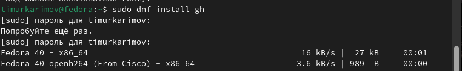{#fig:001 width=100%}

:::
::: {.column width="30%"}

:::
::::::::::::::

## Базовая настройка Git

Задаем имя и email владельца репозитория и настроим UTF-8 в выводе.

:::::::::::::: {.columns align=center}
::: {.column width="70%"}

{#fig:002 width=100%}

:::
::: {.column width="30%"}

:::
::::::::::::::

Настраиваем верификацию и подписание коммитов, параметры *autocrlf* и *safecrlf*.

:::::::::::::: {.columns align=center}
::: {.column width="70%"}

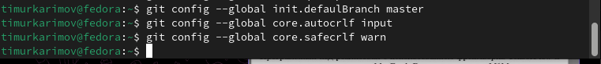{#fig:003 width=100%}

:::
::: {.column width="30%"}

:::
::::::::::::::

## Создание SSH ключей

Создаем SSH ключи по алгоритму RSA и Ed25519.

:::::::::::::: {.columns align=center}
::: {.column width="70%"}

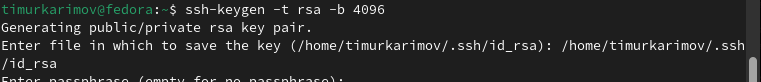{#fig:005 width=100%}

:::
::: {.column width="30%"}

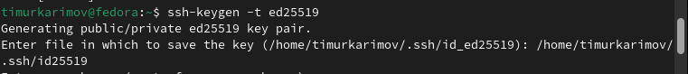{#fig:004 width=100%}

:::
::::::::::::::

## Генерация PGP ключа

Генерируем PGP ключ.

:::::::::::::: {.columns align=center}
::: {.column width="70%"}

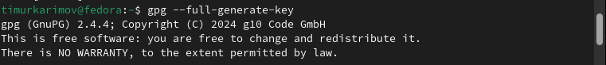{#fig:006 width=100%}

:::
::: {.column width="30%"}

:::
::::::::::::::

Выводим список ключей.

:::::::::::::: {.columns align=center}
::: {.column width="70%"}

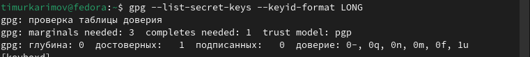{#fig:007 width=100%}

:::
::: {.column width="30%"}

:::
::::::::::::::

## Настройка GitHub

Вводим код для копирования сгенерированного ключа в буфер обмена, а также настроим автоматические подписи коммитов Git.

:::::::::::::: {.columns align=center}
::: {.column width="70%"}

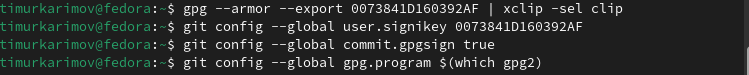{#fig:008 width=100%}

:::
::: {.column width="30%"}

:::
::::::::::::::

Затем авторизуемся.

:::::::::::::: {.columns align=center}
::: {.column width="70%"}

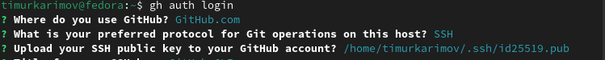{#fig:009 width=100%}

:::
::: {.column width="30%"}

:::
::::::::::::::

## Создание шаблона рабочего пространства

Создадим необходимые директории и перейдем в них, затем создадим собственный репозиторий.

:::::::::::::: {.columns align=center}
::: {.column width="70%"}

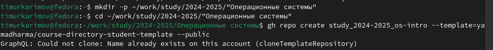{#fig:010 width=100%}

:::
::: {.column width="30%"}

:::
::::::::::::::

Скопируем полученный репозиторий.

:::::::::::::: {.columns align=center}
::: {.column width="70%"}

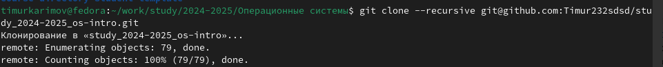{#fig:011 width=100%}

:::
::: {.column width="30%"}

:::
::::::::::::::

Перейдем в каталог курса для удаления лишних файлов и создания необходимых каталогов.

:::::::::::::: {.columns align=center}
::: {.column width="70%"}

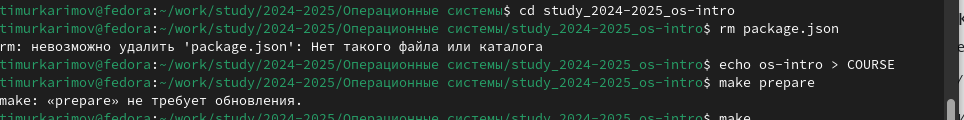{#fig:012 width=100%}

:::
::: {.column width="30%"}

:::
::::::::::::::

Отправим файлы на сервер.

:::::::::::::: {.columns align=center}
::: {.column width="70%"}

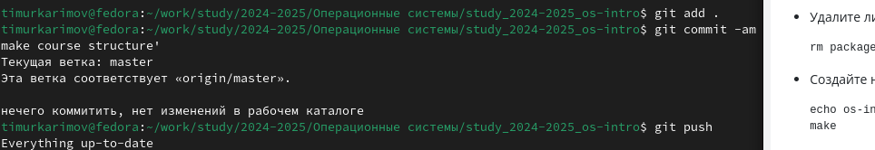{#fig:013 width=100%}

:::
::: {.column width="30%"}

:::
::::::::::::::

# Выводы

Успешно настроена рабочая среда для разработки и управления проектами.

Настроены инструменты для работы с Git и GitHub, включая подписание коммитов с использованием PGP.

Создано рабочее пространство на основе шаблона.

# Список литературы{.unnumbered}

::: {#refs}
:::
