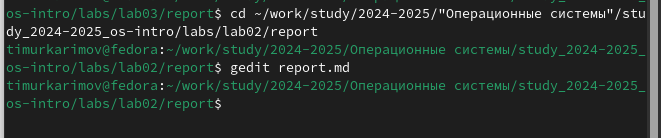
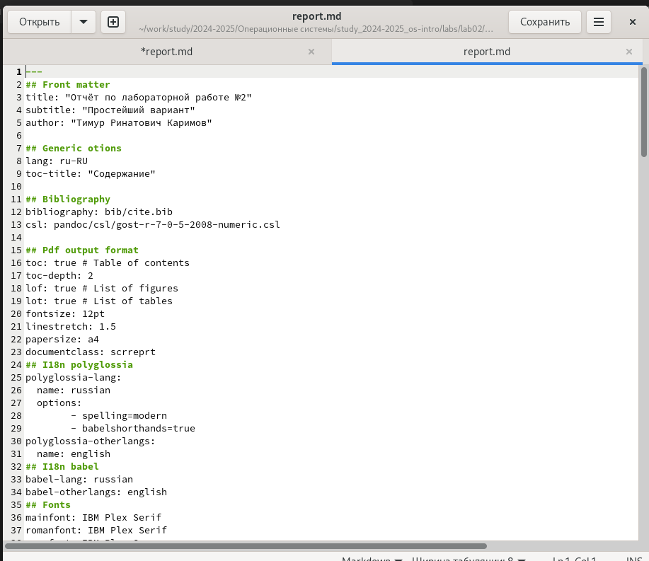
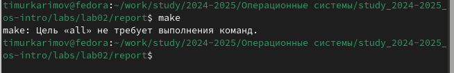
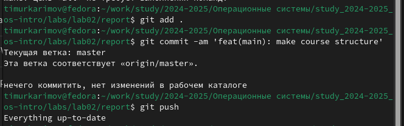

---
## Front matter
lang: ru-RU
title: Отчёт по лабораторной работе №3
subtitle: Оформление отчётов с помощью Markdown
author:
  - Каримов Тимур Ринатович
institute:
  - Российский университет дружбы народов, Москва, Россия
date: 

## i18n babel
babel-lang: russian
babel-otherlangs: english

## Formatting pdf
toc: false
toc-title: Содержание
slide_level: 2
aspectratio: 169
section-titles: true
theme: metropolis
header-includes:
 - \metroset{progressbar=frametitle,sectionpage=progressbar,numbering=fraction}
---

# Информация

## Докладчик

:::::::::::::: {.columns align=center}
::: {.column width="70%"}

  * Каримов Тимур Ринатович
  * Студент 1-курса НММбд-02-24
  * Российский университет дружбы народов
  * [1132246817@pfur.ru](mailto:1132246817@pfur.ru)

:::
::: {.column width="30%"}

:::
::::::::::::::

# Вводная часть

## Актуальность

Оформление отчётов с использованием Markdown позволяет упростить процесс создания структурированных документов, которые легко конвертируются в различные форматы (PDF, HTML и др.).

## Объект и предмет исследования

- Язык разметки Markdown
- Оформление отчётов в соответствии с ГОСТ 7.32-2001
- Работа с GitHub

## Цели и задачи

- Научиться оформлять отчёты с помощью Markdown
- Создать необходимые каталоги и загрузить их на сервер GitHub

# Выполнение лабораторной работы

## Редактирование отчёта

Перейдем в директорию с исходным файлом и с помощью команды *gedit* отредактируем файл *report.md*.

:::::::::::::: {.columns align=center}
::: {.column width="70%"}

{#fig:001 width=100%}

:::
::: {.column width="30%"}

:::
::::::::::::::

## Оформление структуры отчёта

Оформление структуры отчёта согласно ГОСТ 7.32-2001.

:::::::::::::: {.columns align=center}
::: {.column width="70%"}

{#fig:002 width=100%}

:::
::: {.column width="30%"}

:::
::::::::::::::

## Генерация отчёта

Сохранение файла и выполнение команды *make*.

:::::::::::::: {.columns align=center}
::: {.column width="70%"}

{#fig:003 width=100%}

:::
::: {.column width="30%"}

:::
::::::::::::::

## Отправка файлов на GitHub

Отправка файлов на сервер GitHub.

:::::::::::::: {.columns align=center}
::: {.column width="70%"}

{#fig:004 width=100%}

:::
::: {.column width="30%"}

:::
::::::::::::::

# Выводы

- Освоено оформление отчётов с использованием языка разметки Markdown.
- Созданы необходимые каталоги и файлы, загруженные на сервер GitHub.
- Получены навыки работы с инструментами для автоматизации генерации отчётов.

# Список литературы{.unnumbered}

::: {#refs}
:::
